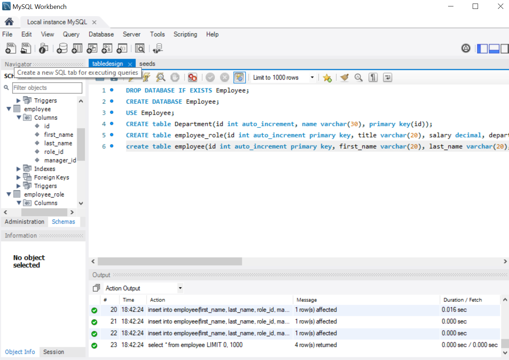
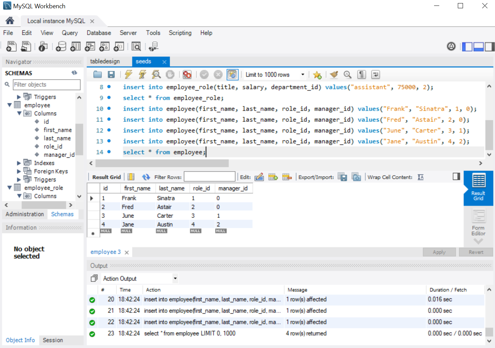
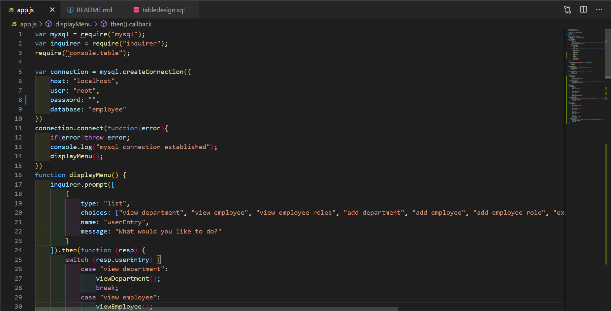

# CLI-Employee-Tracker

## Author

Heather Stolz

## License

This project is protected under the MIT license.
   

## Table of Contents:

* [Description](#description)
* [Installation](#installation)
* [Dependancies](#dependancies)
* [Usage](#usage)
* [Contributors](#contributors)
* [Future Improvments](#future)
* [Questions](#questions)

## Description

A command line application to add, update, and view employee information. 

## Installation

Please run these commands to install dependancies for this project: npm i

## Dependancies

mysql
inquirer
console.table

## Usage

To organize employee data for easy viewing and manipulation.

## Contributors

Heather Stolz and Sangeetha Kaliaperumal(tutor)

## Future Improvements

I plan on abstracting the js file into multiple task specific js files. While using a connecting Class. 

## Images/Video

## Questions

If you have any questions regarding this project, you can find me at [Wanderingtech](https://github.com/Wanderingtech) 

and/or at heather86lyn@gmail.com.